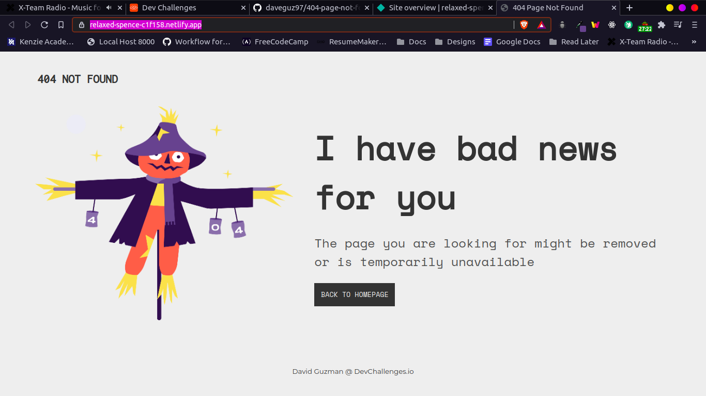

<!-- Please update value in the {}  -->

<h1 align="center">404 Not Found</h1>

   Solution for a challenge from  <a href="http://devchallenges.io" target="_blank">Devchallenges.io</a>.

  <h3>
    <a href="https://relaxed-spence-c1f158.netlify.app/">
      Demo
    </a>
     | 
    <a href="https://github.com/daveguz97/404-page-not-found">
      Solution
    </a>
     | 
    <a href="https://devchallenges.io/challenges/wBunSb7FPrIepJZAg0sY">
      Challenge
    </a>
  </h3>

<!-- TABLE OF CONTENTS -->

## Table of Contents

- [Table of Contents](#table-of-contents)
- [Overview](#overview)
  - [Built With](#built-with)
- [Features](#features)
- [Contact](#contact)

<!-- OVERVIEW -->

## Overview

- You can see my demo in the url above
- It was pretty fun, The hardest part is making it    mobile responsive since css can be tricky.
- I learned a cool way of making the footer stay at the bottom
- Definitely go try out this challenge and test your responsiveness skills :)

### Built With

<!-- This section should list any major frameworks that you built your project using. Here are a few examples.-->

- [HTML5](https://developer.mozilla.org/en-US/docs/Web/Guide/HTML/HTML5)
- [SASS](https://sass-lang.com/)

## Features

<!-- List the features of your application or follow the template. Don't share the figma file here :) -->
The challenge was the first challenge in the mobile responsive path in [DevChallenges](https://devchallenges.io/challenges/wBunSb7FPrIepJZAg0sY). The Objective was to create a 404 page not found and make it mobile responsive. I tested on multiple devices.

## Contact
- GitHub [@daveguz97](https://github.com/daveguz97)
- Twitter [@daveguz97](https://twitter.com/daveguz97)
